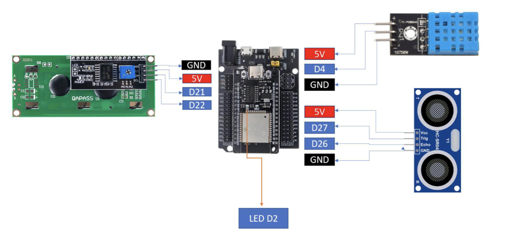
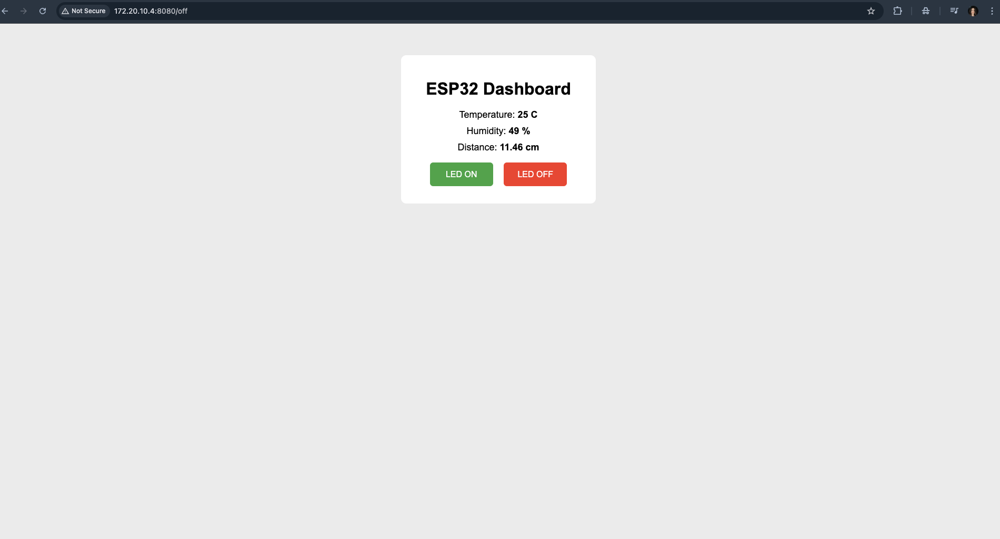
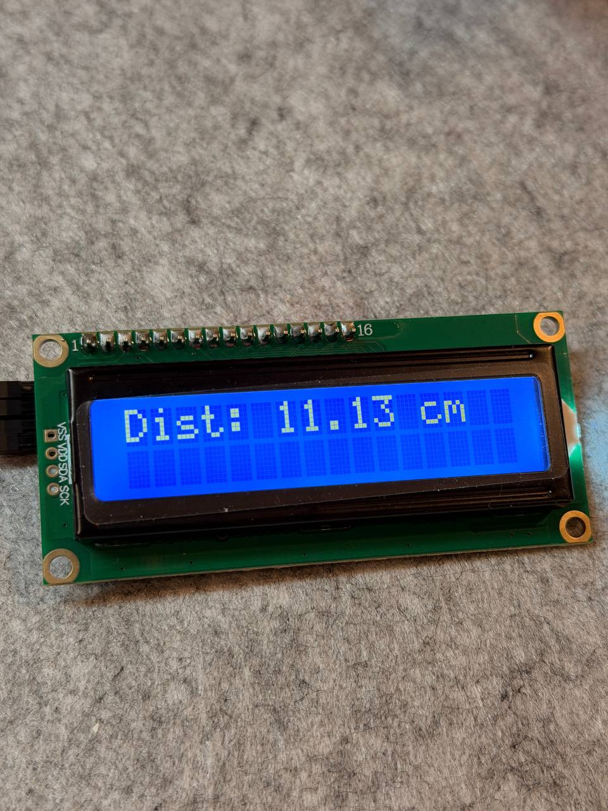
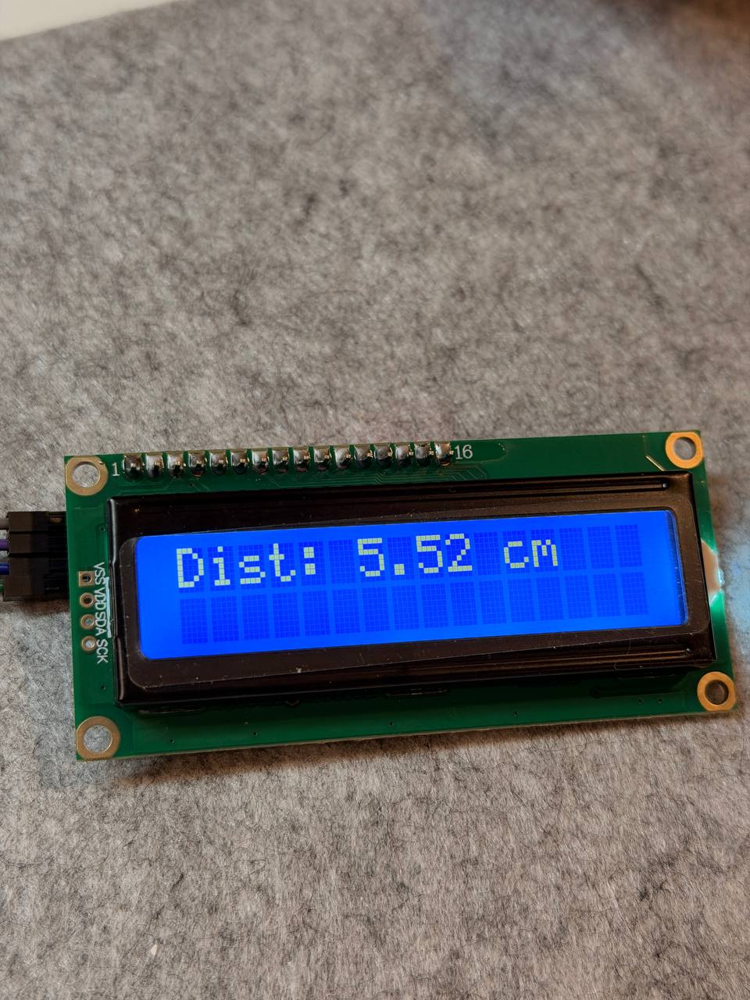
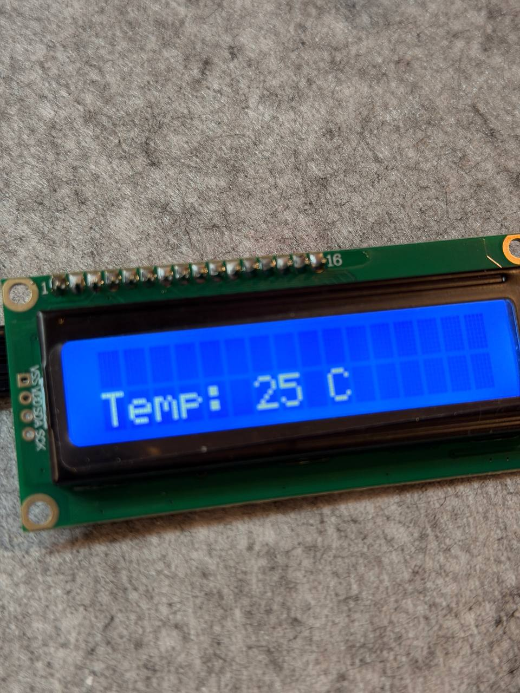
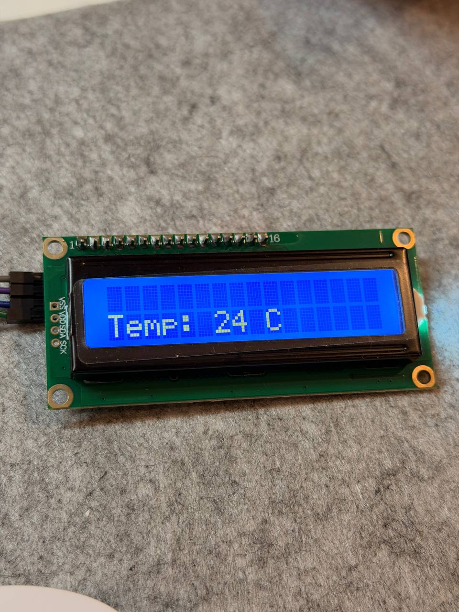

# LAB2: IoT Webserver with LED, Sensors, and LCD Control
## ESP32 IoT System with Web Interface and LCD Display

## Overview

In this lab, we will design an ESP32-based IoT system with MicroPython that integrates a web interface and an LCD display. The system will allow users to control an LED, read sensors, and send custom messages to the LCD through a webserver.

This lab emphasizes interaction between web UI and hardware, giving students practice in event-driven IoT design.

---

## Equipment

- **ESP32 Dev Board** (MicroPython firmware flashed)
- **DHT11 sensor** (temperature/humidity)
- **HC-SR04 ultrasonic distance sensor**
- **LCD 16×2 with I²C backpack**
- **Breadboard** and jumper wires
- **USB cable** + laptop with Thonny
- **Wi-Fi access**

---

## Wiring
- **Wiring diagram**


- **Wiring image**

---

## Setup Instructions

### 1. Hardware Setup
- Connect all components according to the wiring diagram
- Ensure the ESP32 is properly powered via USB
- Verify all sensor connections are secure

### 2. MicroPython Environment
- Open **Thonny IDE** on your laptop
- Connect the ESP32 via USB
- Verify MicroPython firmware is installed (check interpreter in bottom-right corner)
- Select the correct COM port for your ESP32

### 3. Wi-Fi Configuration
Edit each file with your Wi-Fi credentials:

```python
WIFI_SSID = "YourNetworkName"
WIFI_PASSWORD = "YourPassword"
```

### 4. Required Libraries
Upload the following libraries to your ESP32:
- `lcd_api.py` and `machine_i2c_lcd.py` (for I²C LCD)

**Code Source:** [LCD libraries](lcd_libraries)

### 5. Upload Main Code
- The script should:
  - Connect to Wi-Fi
  - Initialize sensors and LCD
  - Start the web server

### 6. Running the Server
1. Reset the ESP32 (press the reset button or run the script)
2. Wait for Wi-Fi connection (monitor serial output in Thonny)
3. Note the **IP address** displayed in the serial monitor
4. Open a web browser and navigate to: `http://<ESP32_IP_ADDRESS>`

**Example:** If the IP is `192.168.1.100` and on port `8080`, go to `http://192.168.1.100:8080` on your browser

### 7. Troubleshooting
- **Can't connect to Wi-Fi:** Check SSID/password, and make sure it is correct
- **Sensor not reading:** Verify wiring and pin assignments
- **LCD not displaying:** Check I²C address
- **Web page not loading:** Ensure ESP32 and laptop (that it is connected to) are on the same network

---

## Tasks and Checkpoints

### Task 1 - LED Control

**Objective:**
- Add two buttons (ON/OFF) on the web page
- When clicked, LED on **GPIO2** should turn ON or OFF

**Code Source:** [task1.py](task1/task1.py)

**Evidence:**
- [Task 1 demo](https://aupp-my.sharepoint.com/:v:/g/personal/2024321thy_aupp_edu_kh/IQDBZAlampzWT7kJgL85XLOnAeZBFaY3daaw_mmAaGUlOCc?nav=eyJyZWZlcnJhbEluZm8iOnsicmVmZXJyYWxBcHAiOiJPbmVEcml2ZUZvckJ1c2luZXNzIiwicmVmZXJyYWxBcHBQbGF0Zm9ybSI6IldlYiIsInJlZmVycmFsTW9kZSI6InZpZXciLCJyZWZlcnJhbFZpZXciOiJNeUZpbGVzTGlua0NvcHkifX0&e=OEQotf)

---

### Task 2 - Sensor Read

**Objective:**
- Read DHT11 temperature and ultrasonic distance
- Show values on the web page (refresh every 1-2 seconds)

**Code Source:** [task2.py](task2/task2.py)

**Evidence:**
- **Screenshot:** 
- **Video:** [Task 2 demo](https://aupp-my.sharepoint.com/:v:/g/personal/2024321thy_aupp_edu_kh/IQBPNYamCX0cQazSHnHjlj_zAVqXEO4yNS5y9QSMG59v0uY?nav=eyJyZWZlcnJhbEluZm8iOnsicmVmZXJyYWxBcHAiOiJPbmVEcml2ZUZvckJ1c2luZXNzIiwicmVmZXJyYWxBcHBQbGF0Zm9ybSI6IldlYiIsInJlZmVycmFsTW9kZSI6InZpZXciLCJyZWZlcnJhbFZpZXciOiJNeUZpbGVzTGlua0NvcHkifX0&e=8EcLN3)

---

### Task 3 - Sensor → LCD

**Objective:**
- Add two buttons:
  - **Show distance** → writes distance to LCD line 1
  - **Show temp** → writes temperature to LCD line 2

**Code Source:** [task3.py](task3/task3.py)

**Evidence:**
- **Photo:** 
<table>
  <tr>
    <td></td>
    <td></td>
    <td></td>
    <td></td>
  </tr>
</table>

- **Video:** [Task 3 demo](https://aupp-my.sharepoint.com/:v:/g/personal/2024321thy_aupp_edu_kh/IQDvDxLmc6FfTYuMWxhWHd9QASYIGz5BD9vRAVeZoGY-v60?nav=eyJyZWZlcnJhbEluZm8iOnsicmVmZXJyYWxBcHAiOiJPbmVEcml2ZUZvckJ1c2luZXNzIiwicmVmZXJyYWxBcHBQbGF0Zm9ybSI6IldlYiIsInJlZmVycmFsTW9kZSI6InZpZXciLCJyZWZlcnJhbFZpZXciOiJNeUZpbGVzTGlua0NvcHkifX0&e=vnWZf7)

---

### Task 4 - Textbox → LCD

**Objective:**
- Add a textbox + "Send" button on the web page
- User enters custom text → LCD displays it
- **LCD scrolls if the characters are more than 16**

**Code Source:** [task4.py](task4/task4.py)

**Evidence:**
- **Video:** [Task 4 demo](https://aupp-my.sharepoint.com/:v:/g/personal/2024321thy_aupp_edu_kh/IQDEdbfGqedqSrrrLQ0XXO-3AQCfqRhAKcAS0mrfvXQp8qY?nav=eyJyZWZlcnJhbEluZm8iOnsicmVmZXJyYWxBcHAiOiJPbmVEcml2ZUZvckJ1c2luZXNzIiwicmVmZXJyYWxBcHBQbGF0Zm9ybSI6IldlYiIsInJlZmVycmFsTW9kZSI6InZpZXciLCJyZWZlcnJhbFZpZXciOiJNeUZpbGVzTGlua0NvcHkifX0&e=vHmrbO)

---

## Full Demo

**Code Source:** [web_finalize.py](web_finalize.py)

**Complete demonstration of all tasks:**

[Full Demo Video](https://aupp-my.sharepoint.com/:v:/g/personal/2024321thy_aupp_edu_kh/IQA6WYieOKrFRZwo2lkj0Se_AZg0wb0CtUaRj9vovvuPqtU?nav=eyJyZWZlcnJhbEluZm8iOnsicmVmZXJyYWxBcHAiOiJPbmVEcml2ZUZvckJ1c2luZXNzIiwicmVmZXJyYWxBcHBQbGF0Zm9ybSI6IldlYiIsInJlZmVycmFsTW9kZSI6InZpZXciLCJyZWZlcnJhbFZpZXciOiJNeUZpbGVzTGlua0NvcHkifX0&e=4eYfIY)

---

## Notes

- Ensure all components are properly connected before powering the ESP32
- Ensure that the laptop (that you connect the ESP32 to) and the ESP32 are on the same network
- Monitor serial output for debugging information
- The web interface should be responsive and update sensor readings automatically
- Test each task incrementally before proceeding to the next

---

## Author

*IoT group 5*

**Date:** February 1, 2026

---

## Project Structure

```
Lab2/
├── README.md
├── lcd_libraries/
│   ├── lcd_api.py              # LCD API library
│   └── machine_i2c_lcd.py      # I²C LCD driver
├── task1/
│   └── task1.py                # LED control code
├── task2/
│   ├── task2.png               # Screenshot/image for task 2
│   └── task2.py                # Sensor reading code
├── task3/
│   ├── task3-dist1.jpg         # Distance reading photo 1
│   ├── task3-dist2.jpg         # Distance reading photo 2
│   ├── task3-temp1.jpg         # Temperature reading photo 1
│   ├── task3-temp2.jpg         # Temperature reading photo 2
│   └── task3.py                # Sensor to LCD display code
├── task4/
│   └── task4.py                # Text input to LCD code
├── wiring/
│   ├── wiring-diagram.png      # Circuit diagrams and schematics
│   └── wiring-image.JPG
└── web_finalize.py             # Final web server code
```