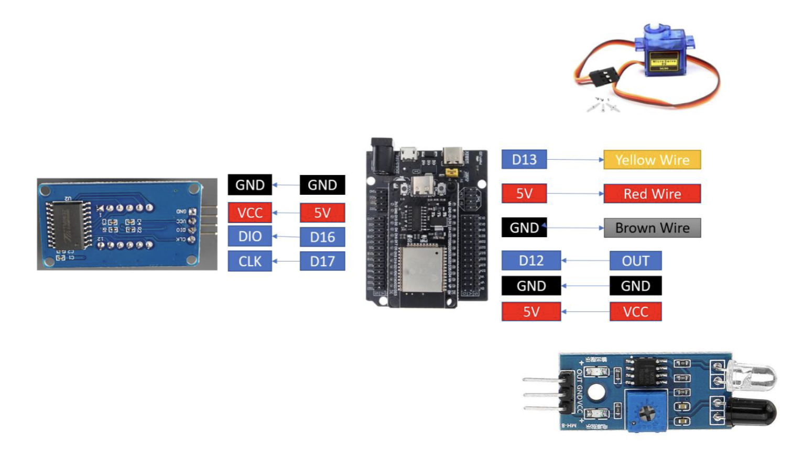
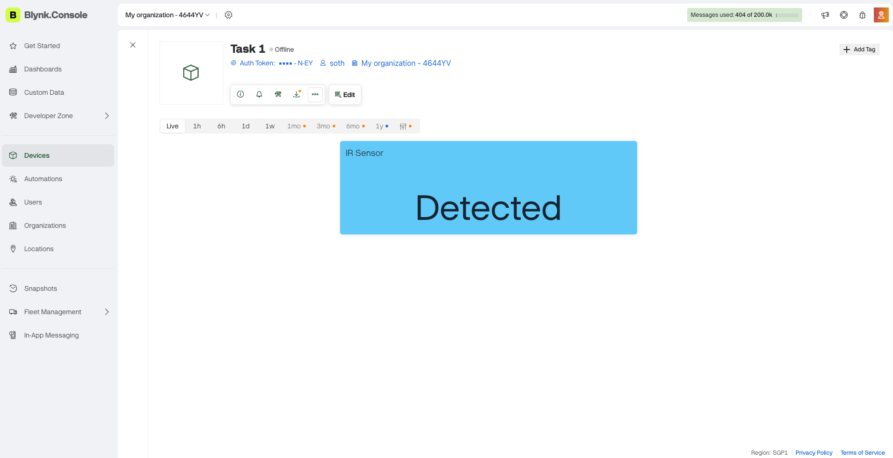
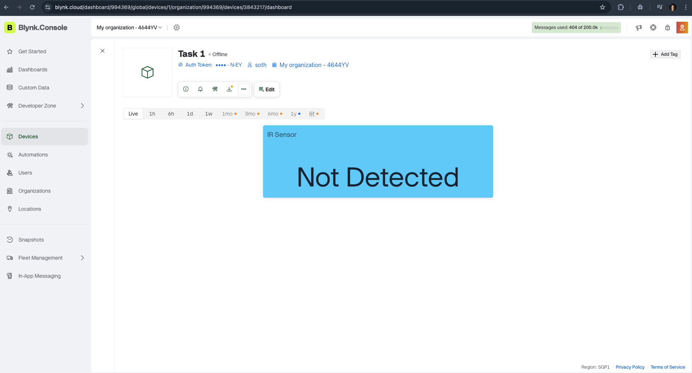
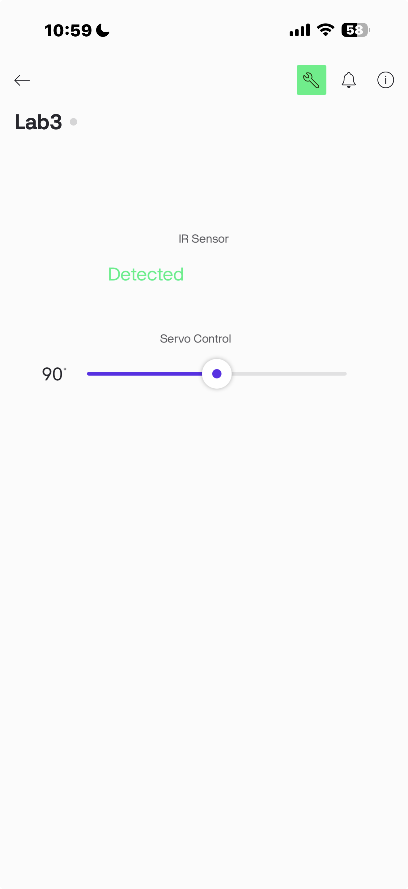
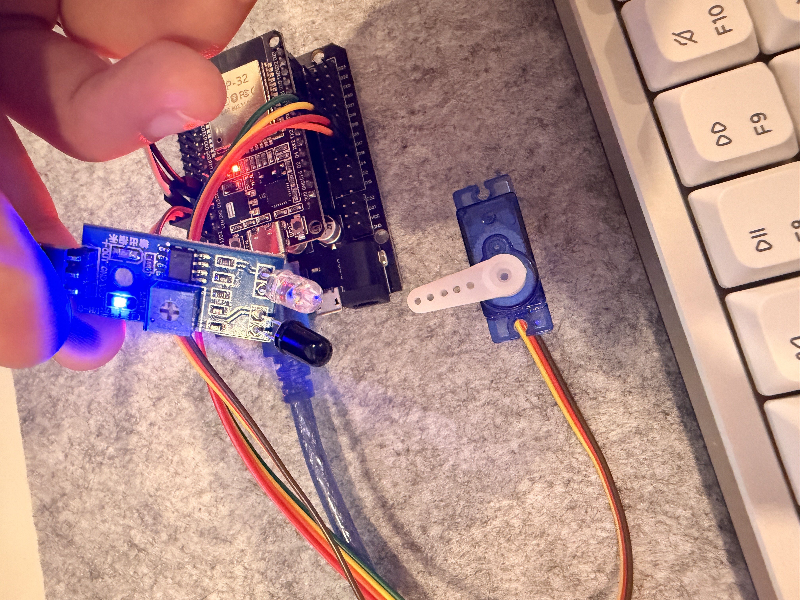
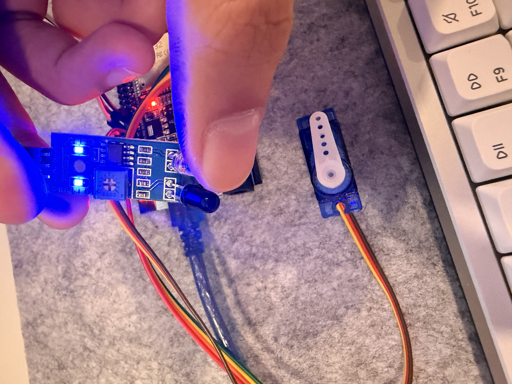
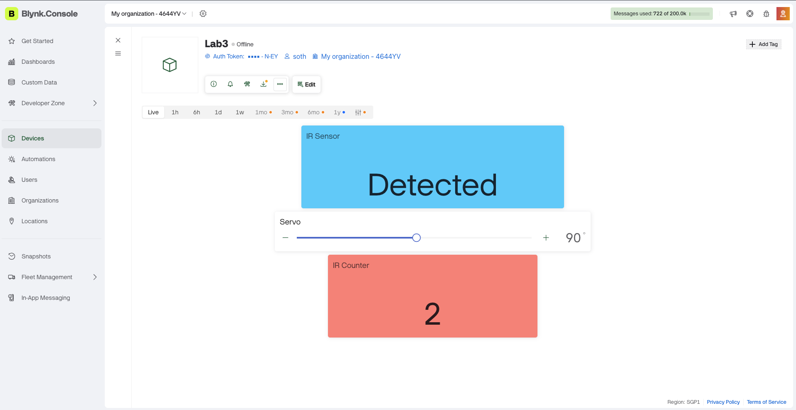
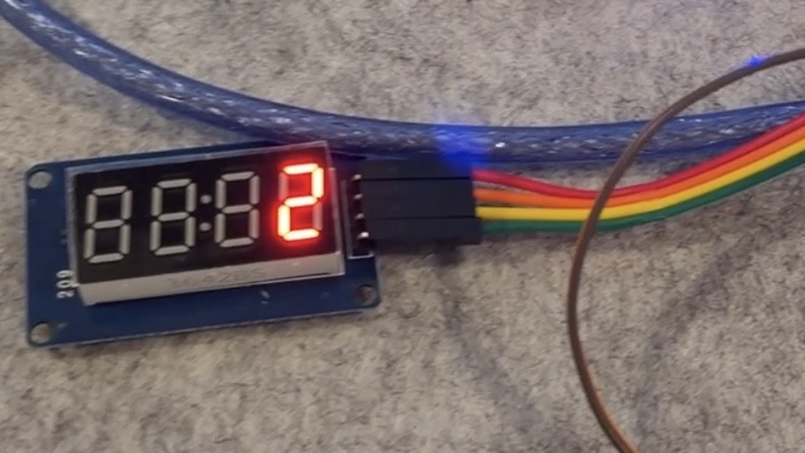
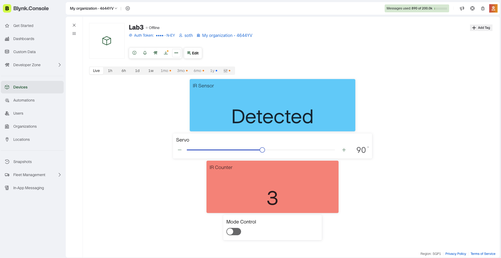

# Lab 3 –  IoT Smart Gate Control with Blynk, IR Sensor, Servo Motor, and TM1637

## 1. Overview

In this lab, we design and implement an ESP32-based IoT system using MicroPython
and the Blynk platform. The system integrates an IR sensor for object detection, a servo motor for physical actuation, and a TM1637 7-segment display for real-time local feedback. Students will use the Blynk mobile application to remotely control the system, monitor sensor status, and observe system behavior.

This lab emphasizes interaction between sensors, actuators, cloud-based control, and local
display, reinforcing event-driven and IoT system design concepts.

### System Features

- Real-time IR detection
- Automatic servo gate simulation
- Event counter system
- Local 4-digit display output
- Cloud-based monitoring via Blynk
- Manual override safety mode

---

## 2. Equipments

### Hardware Components Used
- ESP32
- IR Obstacle Sensor
- Servo Motor
- TM1637 4-Digit 7-Segment Display
- Blynk IoT Platform

---

### Software Used
- Thonny IDE
- Blynk Cloud Dashboard

---

## 3. Wiring diagram & picture

## 4. System Description

The IR sensor detects the presence of an object in front of the system. When an object is detected, the ESP32 processes the signal and automatically rotates the servo motor to simulate opening a gate or barrier. After a short delay, the servo returns to the closed position.

Each detection event increments a counter. The counter value is displayed locally on the TM1637 4-digit display and is also sent to the Blynk application for remote monitoring.

Users can manually override the automatic system through the Blynk application. When manual mode is enabled, the IR sensor is ignored and the servo remains in a safe closed position.

---

## 5. Tasks & Checkpoints

All submitted work is original. Plagiarism or code sharing is strictly prohibited.

---

## Task 1 – IR Sensor Reading

**Objective:**
- Read IR sensor digital output using ESP32.
- Display IR status (Detected / Not Detected) on Blynk.

### Evidence

**Task 1 Blynk dashboard:**

- Detected:

- Not Detected:

**Video Evidence:**: [Task 1 Demo Video](https://aupp-my.sharepoint.com/:v:/g/personal/2024321thy_aupp_edu_kh/IQABXYSsoFinQaGssVajp5MhAYgewLjD1mUyru3XSENyn3U?nav=eyJyZWZlcnJhbEluZm8iOnsicmVmZXJyYWxBcHAiOiJPbmVEcml2ZUZvckJ1c2luZXNzIiwicmVmZXJyYWxBcHBQbGF0Zm9ybSI6IldlYiIsInJlZmVycmFsTW9kZSI6InZpZXciLCJyZWZlcnJhbFZpZXciOiJNeUZpbGVzTGlua0NvcHkifX0&e=9qyo4X)

---

## Task 2 – Servo Motor Control via Blynk

**Objective:**
- Add a Blynk Slider widget to control servo position.
- Slider position from 0 to 180 degrees.
- Servo follows slider movement.

### Evidence

**Task 2 Blynk dashboard:**

- Desktop dashboard:

- Mobile dashboard:

**Video Evidence:**

- [Task 2 Demo Video](https://aupp-my.sharepoint.com/:v:/g/personal/2024321thy_aupp_edu_kh/IQB6rgJUBRqiRaGYnIa8FAbsAcyY0_kD6VeZk-xd57M8TPE?nav=eyJyZWZlcnJhbEluZm8iOnsicmVmZXJyYWxBcHAiOiJPbmVEcml2ZUZvckJ1c2luZXNzIiwicmVmZXJyYWxBcHBQbGF0Zm9ybSI6IldlYiIsInJlZmVycmFsTW9kZSI6InZpZXciLCJyZWZlcnJhbFZpZXciOiJNeUZpbGVzTGlua0NvcHkifX0&e=AFtInj)

- [Task 2 Blynk mobile control](https://aupp-my.sharepoint.com/:v:/g/personal/2024321thy_aupp_edu_kh/IQDvERqjMXQsTKQWdVDDd6KWAXT7RD6pp_o06GLVGMJUJKY?nav=eyJyZWZlcnJhbEluZm8iOnsicmVmZXJyYWxBcHAiOiJPbmVEcml2ZUZvckJ1c2luZXNzIiwicmVmZXJyYWxBcHBQbGF0Zm9ybSI6IldlYiIsInJlZmVycmFsTW9kZSI6InZpZXciLCJyZWZlcnJhbFZpZXciOiJNeUZpbGVzTGlua0NvcHkifX0&e=pWjdnB)

---

## Task 3 – Automatic IR - Servo Action

**Objective:**
- When IR sensor detects an object, servo opens automatically.
- After a short delay, servo returns to closed position.

### Evidence

**Photo Evidences:**

Servo Closed:

Servo Opened:

**Video Evidence:** [Task 3 Demo Video](https://aupp-my.sharepoint.com/:v:/g/personal/2024321thy_aupp_edu_kh/IQDYGBHRuDmMRY2iLNpcOPLVAW7bseRArU2vis_u3l_mooU?nav=eyJyZWZlcnJhbEluZm8iOnsicmVmZXJyYWxBcHAiOiJPbmVEcml2ZUZvckJ1c2luZXNzIiwicmVmZXJyYWxBcHBQbGF0Zm9ybSI6IldlYiIsInJlZmVycmFsTW9kZSI6InZpZXciLCJyZWZlcnJhbFZpZXciOiJNeUZpbGVzTGlua0NvcHkifX0&e=XU9f0F)

---

## ✅ Task 4 – TM1637 Display Integration

**Objective:**
- Count the number of IR detection events.
- Display the counter value on TM1637 display.
- Send the same value to Blynk numeric display widget.

### Evidence

**Task 4 Blynk dashboard:**

- Blynk IR counter:

- TM1637 counter:

**Video Evidence:** [Task 4 Demo Video](https://aupp-my.sharepoint.com/:v:/g/personal/2024321thy_aupp_edu_kh/IQBUfcyRlSW6R7qpbDBDZrRzAWJFWplHA2XAgxIfpFPphf8?nav=eyJyZWZlcnJhbEluZm8iOnsicmVmZXJyYWxBcHAiOiJPbmVEcml2ZUZvckJ1c2luZXNzIiwicmVmZXJyYWxBcHBQbGF0Zm9ybSI6IldlYiIsInJlZmVycmFsTW9kZSI6InZpZXciLCJyZWZlcnJhbFZpZXciOiJNeUZpbGVzTGlua0NvcHkifX0&e=m7atLJ)

---

## ✅ Task 5 – Manual Override Mode

**Objective:**
- Add a Blynk switch to enable/disable automatic IR mode.
- When manual mode is active, IR sensor is ignored.
- Servo remains closed in manual mode.

### Evidence

**Photo Evidence:**

Active (Automatic) Mode:

Manual Override Mode:

**Video Evidence:** [Task 5 Demo Video](https://aupp-my.sharepoint.com/:v:/g/personal/2024321thy_aupp_edu_kh/IQCy_v-52l4-R4ZkTgxNjwDbAdgJat5RSUPnDZB86PEZeVs?nav=eyJyZWZlcnJhbEluZm8iOnsicmVmZXJyYWxBcHAiOiJPbmVEcml2ZUZvckJ1c2luZXNzIiwicmVmZXJyYWxBcHBQbGF0Zm9ybSI6IldlYiIsInJlZmVycmFsTW9kZSI6InZpZXciLCJyZWZlcnJhbFZpZXciOiJNeUZpbGVzTGlua0NvcHkifX0&e=dOLdgH)

---

## Conclusion

This project demonstrates a complete IoT-based smart gate system integrating sensing, actuation, local display feedback, cloud synchronization, and user override control. The system ensures both automation and safety through manual override functionality.