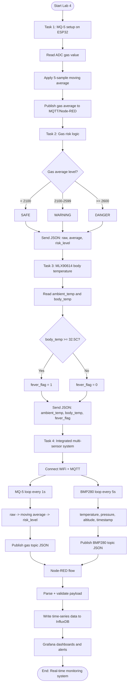

## Complete Task Flowchart (Task 1-Task 4)

```mermaid
flowchart TD
    A([Start Lab 4]) --> B[Task 1: MQ-5 setup on ESP32]
    B --> B1[Read ADC gas value]
    B1 --> B2[Apply 5-sample moving average]
    B2 --> B3[Publish gas average to MQTT/Node-RED]

    B3 --> C[Task 2: Gas risk logic]
    C --> C1{Gas average level?}
    C1 -->|< 2100| C2[SAFE]
    C1 -->|2100-2599| C3[WARNING]
    C1 -->|>= 2600| C4[DANGER]
    C2 --> C5[Send JSON: raw, average, risk_level]
    C3 --> C5
    C4 --> C5

    C5 --> D[Task 3: MLX90614 body temperature]
    D --> D1[Read ambient_temp and body_temp]
    D1 --> D2{body_temp >= 32.5C?}
    D2 -->|Yes| D3[fever_flag = 1]
    D2 -->|No| D4[fever_flag = 0]
    D3 --> D5[Send JSON: ambient_temp, body_temp, fever_flag]
    D4 --> D5

    D5 --> E[Task 4: Integrated multi-sensor system]
    E --> E1[Connect WiFi + MQTT]
    E1 --> E2[MQ-5 loop every 1s]
    E1 --> E3[BMP280 loop every 5s]
    E2 --> E4[raw -> moving average -> risk_level]
    E3 --> E5[temperature, pressure, altitude, timestamp]
    E4 --> F[Publish gas topic JSON]
    E5 --> G[Publish BMP280 topic JSON]

    F --> H[Node-RED flow]
    G --> H
    H --> I[Parse + validate payload]
    I --> J[Write time-series data to InfluxDB]
    J --> K[Grafana dashboards and alerts]
    K --> L([End: Real-time monitoring system])
```

---

