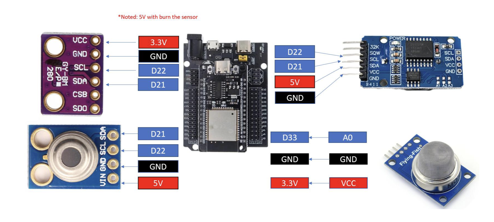
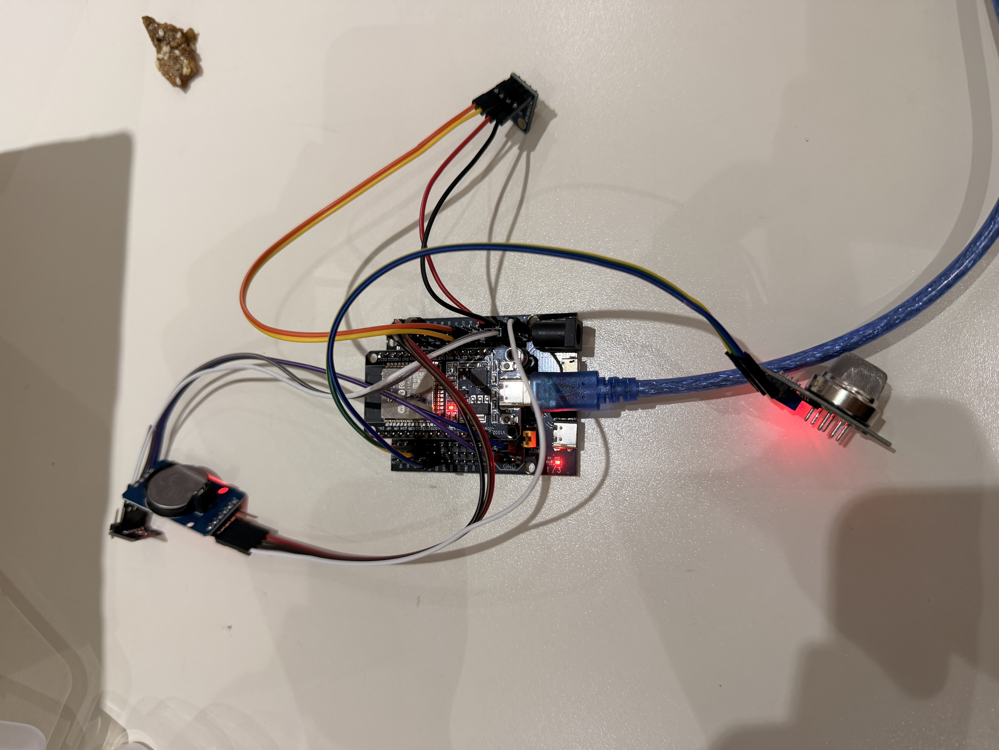
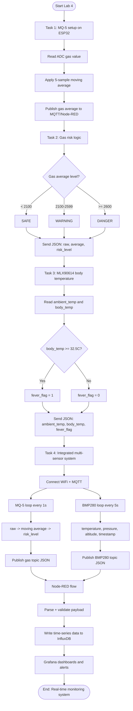

# Lab 4 - Multi-Sensor IoT Monitoring System with Grafana Dashboard

## Overview
This project implements a **multi-sensor IoT monitoring system** using **ESP32 with MicroPython (Thonny)**. The system collects environmental and health-related data from multiple sensors and performs **edge processing** before transmitting data to a cloud visualization pipeline.

The ESP32 reads data from **MQ-5 (gas sensor), MLX90614 (body temperature), BMP280 (pressure/altitude/room temperature), and DS3231 (RTC)**. Before sending data to Node-RED, the ESP32 applies **moving average filtering**, **risk classification**, and **fever detection logic**.

Processed data is sent to **Node-RED**, stored in **InfluxDB**, and visualized using a **Grafana dashboard**.

---

## System Architecture

→ 
→ 
→ 

### Architecture Diagram

### Hardware Wiring Setup

---

## Sensors Used

| Sensor | Interface | Purpose |
|------|-----------|---------|
| MQ-5 Gas Sensor | Analog (ADC 12-bit) | Gas concentration level |
| MLX90614 | I2C | Body temperature (IR) |
| BMP280 | I2C | Room temp, pressure, altitude |
| DS3231 RTC | I2C | Timestamp generation |

---

## Edge Processing Logic

### 1) Moving Average Filtering (MQ-5)
MQ-5 readings are noisy, so the ESP32 stores the **last 5 ADC readings** and computes a moving average:

\`\`\`
gas_avg = (x1 + x2 + x3 + x4 + x5) / 5
\`\`\`

The ESP32 prints **raw vs averaged** values and transmits the averaged value.

---

### 2) Gas Risk Classification
Risk level is classified using the filtered gas average:

| Gas Average | Risk Level |
|-----------:|------------|
| < 2100 | SAFE |
| 2100–2599 | WARNING |
| ≥ 2600 | DANGER |

The ESP32 sends `risk_level` along with sensor data.

---

### 3) Fever Detection Logic
Body temperature is evaluated for fever:

\`\`\`
if body_temp >= 32.5:
    fever_flag = 1
else:
    fever_flag = 0
\`\`\`

The ESP32 sends `fever_flag` in the data packet.

---

## Data Packet Format (JSON)
The ESP32 sends processed data to Node-RED in JSON format.

Example:

\`\`\`json
{
  "timestamp": "2026-03-05 10:25:30",
  "gas_raw": 2150,
  "gas_avg": 2205,
  "risk_level": "WARNING",
  "body_temp": 33.1,
  "fever_flag": 1,
  "pressure": 1007.3,
  "altitude": 13.5
}
\`\`\`

---

## Node-RED
Node-RED is used to:
- Receive the JSON payload from ESP32
- Parse and validate incoming data
- Write time-series fields into InfluxDB

---

## InfluxDB
InfluxDB stores the system’s time-series data such as:
- Gas average
- Risk level
- Body temperature
- Fever flag
- Pressure
- Altitude
- RTC timestamp

---

## Grafana Dashboard Panels
Grafana visualizes the stored data with these required panels:

1. **Gas Average (Time Series)**
2. **Risk Level Display (SAFE/WARNING/DANGER)**
3. **Body Temperature Gauge**
4. **Pressure Graph (hPa)**
5. **Altitude Graph (meters)**

---

## Complete Task Flowchart (Task 1-Task 4)

---

## Academic Integrity
All submitted work must be original. **Code sharing is strictly prohibited.**
