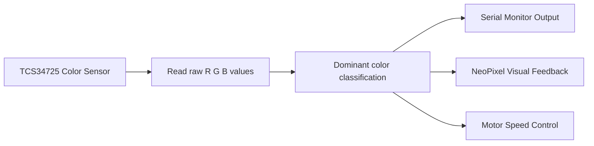
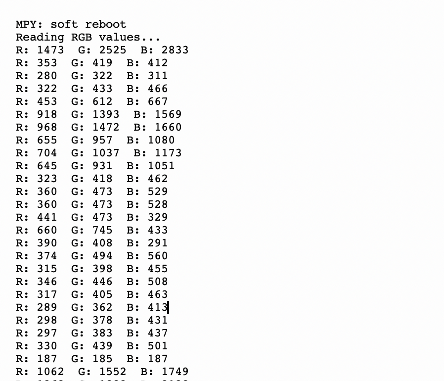

# Lab 5 - Color-Aware IoT Control with ESP32, TCS34725, NeoPixel, and DC Motor


## Overview

Lab 5 is a progressive ESP32 MicroPython lab focused on **color sensing and reactive control**. The system uses a **TCS34725 RGB color sensor** to read reflected color values, then turns those readings into decisions that drive visible and physical outputs.

The lab is structured as a clean pipeline:

1. Read raw RGB values from the sensor
2. Classify the dominant detected color
3. Visualize the detected color using a NeoPixel ring
4. Control DC motor speed based on the detected color

This lab demonstrates a practical IoT pattern: **sense -> classify -> respond**.

---

## Demo Videos

- [Task 2 Demo - Basic Color Classification](https://youtu.be/MnauJ5T9L4k)
- [Task 3 Demo - NeoPixel Visual Feedback](https://youtu.be/VtQrTx3tlNY)
- [Task 4 Demo - Motor Speed Control](https://youtu.be/raTd_V2fLhA)

---

## System Flow



---

## Learning Objectives

- Interface an ESP32 with the TCS34725 color sensor over I2C
- Read and interpret raw RGB color data in MicroPython
- Implement simple rule-based color classification
- Drive a NeoPixel LED strip based on sensor input
- Control a DC motor with PWM using detected color as the control signal
- Build confidence moving from sensing only to closed-loop actuation

---

## Hardware and Software

### Hardware

- ESP32
- TCS34725 RGB color sensor
- 24-pixel NeoPixel ring / strip
- DC motor
- Motor driver module
- Jumper wires and power supply

### Software

- MicroPython
- Thonny IDE
- `tcs34725` MicroPython driver
- `neopixel` module

---

## Pin Mapping Used in the Code

| Device | ESP32 Pin | Notes |
|------|-----------|-------|
| TCS34725 `SCL` | GPIO 22 | I2C clock |
| TCS34725 `SDA` | GPIO 21 | I2C data |
| NeoPixel `DIN` | GPIO 23 | Task 3 |
| Motor Driver `IN1` | GPIO 27 | Task 4 direction control |
| Motor Driver `IN2` | GPIO 26 | Task 4 direction control |
| Motor Driver `ENA` | GPIO 14 | PWM speed control |

---

## Task Breakdown

### Task 1 - Raw RGB Reading

**File:** `Task1/task1.py`

The first task verifies that the TCS34725 sensor is correctly connected and readable from the ESP32. The program continuously reads the raw red, green, blue, and clear-channel values and prints the RGB values to the serial monitor every second.

This is the calibration and observation step of the lab. Before the system can make decisions, it must first prove that the sensor is returning stable data.

### What this task does

- Initializes I2C on GPIO 22 and GPIO 21
- Creates a TCS34725 sensor object
- Reads raw `R`, `G`, `B`, and `C` values
- Prints the raw RGB values once per second

### Preview



---

### Task 2 - Basic Color Classification

**File:** `Task2/task2.py`

Task 2 adds simple edge logic to transform raw sensor readings into a label. The code compares the three RGB channels and selects the channel with the strongest value as the detected color.

### Classification logic

- If `R` is the largest value -> `RED`
- If `G` is the largest value -> `GREEN`
- If `B` is the largest value -> `BLUE`
- Otherwise -> `UNKNOWN`

This is a lightweight and readable rule-based classifier. It works well for clearly separated colors, though it may label mixed or low-light readings as `UNKNOWN`.

### What this task does

- Reads raw RGB values
- Classifies the dominant color
- Prints both the raw readings and the detected label

### Demo

The demo below shows Task 2 classifying the dominant detected color in real time while different colors are presented to the sensor.

[Watch Task 2 Demo](https://youtu.be/MnauJ5T9L4k)

---

### Task 3 - NeoPixel Visual Feedback

**File:** `Task3/task3.py`

Task 3 turns the classification result into immediate visual feedback. A 24-pixel NeoPixel ring is connected to GPIO 23, and all LEDs are updated to match the detected color.

### Behavior

- Detected `RED` -> all LEDs become red
- Detected `GREEN` -> all LEDs become green
- Detected `BLUE` -> all LEDs become blue
- `UNKNOWN` -> LEDs turn off

This task makes the system far more interactive because the sensor result is no longer visible only in the serial monitor; it now appears directly in the physical system.

### Demo

The demo below shows Task 3 updating the NeoPixel ring color based on the detected object color.

[Watch Task 3 Demo](https://youtu.be/VtQrTx3tlNY)

---

### Task 4 - Motor Speed Control with Color Sensor

**File:** `Task4/task4.py`

Task 4 extends the same detection logic to a physical actuator. A DC motor is controlled through a motor driver using two direction pins and one PWM enable pin. The detected color determines the PWM duty value applied to the motor.

### Motor response mapping

| Detected Color | PWM Value | Motor Behavior |
|---------------|-----------|----------------|
| `RED` | `700` | Fast |
| `GREEN` | `500` | Medium |
| `BLUE` | `300` | Slow |
| `UNKNOWN` | `0` | Stop |

### What this task demonstrates

- Sensor-driven actuation
- PWM speed control on ESP32
- Simple embedded decision-making from real-world input

This is the most complete implementation in the lab because it closes the loop from sensing to decision to physical action.

### Demo

The demo below shows Task 4 using the detected color to control DC motor speed in real time.

[Watch Task 4 Demo](https://youtu.be/raTd_V2fLhA)

---

### Task 5 - Pending Development

`Task5/` is currently pending and still under development.

We plan to complete Task 5 by Sunday, April 5, 2026. Unfortunately, the required components and microcontroller are still in the lab and the campus is closed, so we are unable to continue full development and integration with the MIT App Inventor application as instructed for Task 5.

---

## Repository Structure

```text
Lab5/
├── README.md
├── Task1/
│   ├── task1.py
│   └── task1.png
├── Task2/
│   └── task2.py
├── Task3/
│   └── task3.py
├── Task4/
│   └── task4.py
└── Task5/
```

---

## How to Run

1. Connect the TCS34725 sensor to the ESP32 using the I2C pins defined in the code.
2. Upload the required MicroPython libraries, especially the `tcs34725` driver.
3. Open one task file at a time in Thonny.
4. Run the script on the ESP32.
5. Observe the output in the serial monitor or on the connected hardware.

Recommended order:

1. `Task1/task1.py`
2. `Task2/task2.py`
3. `Task3/task3.py`
4. `Task4/task4.py`

---

## Notes and Limitations

- The color classification is based only on the largest raw RGB value, so it is simple but not calibrated.
- Ambient light, object distance, and surface reflectivity can affect readings.
- The repository currently does not include the `tcs34725.py` driver file, so it must already be installed on the ESP32 filesystem.
- PWM values in Task 4 are tuned as fixed levels rather than computed dynamically.

---

## Conclusion

Lab 5 is a strong example of embedded IoT development in stages. It begins with raw sensor acquisition, adds interpretation through classification, then extends that logic into both visual feedback and motor control. The result is a compact but meaningful color-reactive system that connects sensor data directly to real-world behavior.
