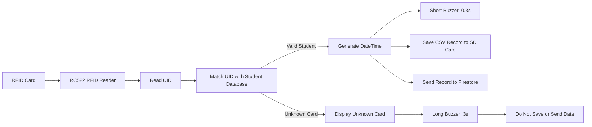
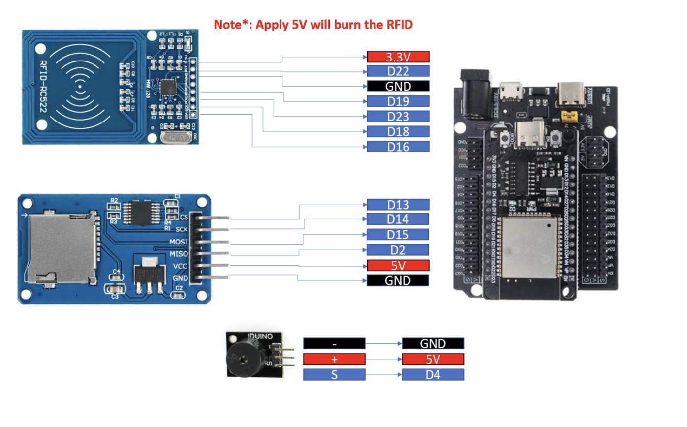
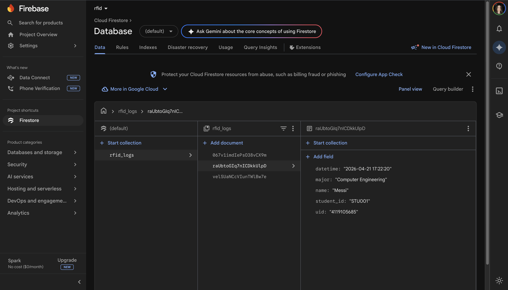

# Lab 6 - Smart RFID System with Cloud & SD Logging


## Overview

Lab 6 is an ESP32 MicroPython lab focused on building a **smart RFID-based attendance system**. The system uses an **RFID-RC522 reader** to scan RFID cards, checks each card against a predefined student database, and records valid attendance data both locally and remotely.

In this lab, I built a system that can identify students using RFID cards, save valid attendance records to an SD card, upload the same records to Firestore, and provide real-time feedback using a buzzer.

The lab is structured as a clean attendance pipeline:

1. Read the UID from an RFID card
2. Match the UID with predefined student data
3. Generate the current date and time
4. Log valid attendance to SD card and Firestore
5. Reject unknown cards without saving data

This lab demonstrates a practical IoT pattern: **scan -> identify -> log -> respond**.

---

## System Flow



---

## Learning Objectives

- Integrate SPI-based RFID sensor `RC522` with ESP32
- Implement UID-based identification system
- Design structured data storage in CSV format
- Store data locally using SD card and remotely using Firestore
- Implement real-time feedback using a buzzer
- Apply system integration across multiple modules

---

## Hardware and Software

### Hardware

- ESP32
- RFID-RC522 module
- RFID card or RFID tag
- SD card module
- MicroSD card
- Buzzer
- Jumper wires
- Breadboard or circuit setup
- USB cable / power supply

### Software

- MicroPython
- Thonny IDE
- RFID-RC522 MicroPython driver
- SD card support for MicroPython
- Firestore / Firebase cloud database
- Wi-Fi connection for cloud logging

### Wiring
<!-- Insert Blynk screenshots here -->


---

## Project Title

**Smart RFID System with Cloud & SD Logging**

This project simulates a smart attendance system where each student is identified using an RFID card. When a card is scanned, the ESP32 reads its UID, checks whether it belongs to a known student, and then decides whether the attendance record should be saved.

---

## How It Works

The system works by reading an RFID card UID and comparing it with a predefined student database. If the UID matches a registered student, the ESP32 creates an attendance record using the student's information and the current timestamp.

For valid cards, the record is saved in two places:

- Locally on the SD card as a CSV row
- Remotely in Firestore as a cloud attendance record

For invalid cards, the system only gives feedback. It displays `Unknown Card`, activates the buzzer for a longer duration, and does not save or upload anything.

---

## Task Breakdown

### 1. Read UID from RFID Card

This verifies that the RFID-RC522 module can detect a card and read its unique ID. The UID is the main value used to identify whether the scanned card belongs to a registered student.

***What this task does***

- Detects when an RFID card is placed near the reader
- Retrieves the card's unique ID `UID`
- Prints or displays the UID for checking
- Confirms that the ESP32 can communicate with the RFID-RC522 module

---

### 2. Match UID with Student Database

This adds the identification logic. The scanned UID is compared with predefined student data stored in the program.

***Matching logic***

- If the UID is found -> valid student
- If the UID is not found -> unknown card

Each valid student record should include the student's UID, name, student ID, and major. This allows the system to store complete attendance information instead of only saving the raw card UID.

***What this task does***

- Stores predefined student information
- Compares the scanned UID with known UIDs
- Retrieves student details when a match is found
- Marks the scan as `Unknown Card` when no match exists

---

### 3. Generate Current DateTime

This adds timestamp generation. Every valid attendance record must include the current date and time.

***Required DateTime format***

```text
YYYY-MM-DD HH:MM:SS
```

***Example***

```text
2026-04-21 09:30:15
```

The same timestamp format is used for both the SD card CSV file and the Firestore record.

---

### 4. Valid UID Attendance Logging

This handles the full valid-card workflow. When the scanned UID matches a student in the database, the system treats the scan as a successful attendance entry.

***Valid card behavior***

- Activates the buzzer for `0.3` seconds
- Generates the current date and time
- Saves attendance data to the SD card in CSV format
- Sends the same attendance data to Firestore

***Data saved for each valid scan***

```text
UID, Name, StudentID, Major, DateTime
```

This step combines identification, local storage, cloud storage, and user feedback into one complete workflow.

---

### 5. Invalid UID Handling

This defines what happens when the scanned RFID card is not registered in the student database.

***Invalid card behavior***

- Activates the buzzer for `3` seconds
- Displays `Unknown Card`
- Does not save data to the SD card
- Does not send data to Firestore

This prevents unregistered cards from creating false attendance records.

---

## Data Logging Format

The SD card stores valid attendance records in CSV format. This makes the data easy to review, submit, and open in spreadsheet software.

### CSV header

```csv
UID,Name,StudentID,Major,DateTime
```

### Sample CSV row

```csv
A1B2C3D4,John Student,2024321,IoT,2026-04-21 09:30:15
```

### Full sample format

```csv
UID,Name,StudentID,Major,DateTime
A1B2C3D4,John Student,2024321,IoT,2026-04-21 09:30:15
```

The SD card acts as the local attendance log, while Firestore stores the same valid records in the cloud.

---

## Firestore Integration

Firestore is used as the remote database for the attendance system. When a valid student card is scanned, the ESP32 sends the attendance record to Firestore after preparing the same data used in the CSV file.

### Firestore record fields

| Field | Description |
|------|-------------|
| `UID` | Unique ID read from the RFID card |
| `Name` | Student name from the predefined database |
| `StudentID` | Student ID number |
| `Major` | Student major |
| `DateTime` | Date and time of the attendance scan |

### Cloud logging behavior

- Valid students are uploaded to Firestore
- Unknown cards are ignored
- Firestore stores the remote attendance copy
- SD card and Firestore records use the same attendance data

This gives the system both **local backup** and **cloud accessibility**.

---

## Buzzer Feedback Logic

The buzzer gives immediate feedback after each RFID scan. I used different buzzer durations to make valid and invalid scans easy to recognize.

| UID Status | Buzzer Duration | System Action |
|-----------|-----------------|---------------|
| Valid UID | `0.3` seconds | Save to SD card and send to Firestore |
| Invalid UID | `3` seconds | Display `Unknown Card` and ignore the scan |

The short beep confirms a successful attendance scan. The longer beep signals that the card is not registered.

---

### 📷 Firebase Screenshots
<!-- Insert telegram interaction screenshots here -->



---

## 🎥 Video Presentation


👉 Watch the demo here:  
[▶️ Link to demo](https://aupp-my.sharepoint.com/:v:/g/personal/2024321thy_aupp_edu_kh/IQA1WwvHkO7-S5ei8pRWcbhuASM11a9GFvClDmBjpYg2PcE?nav=eyJyZWZlcnJhbEluZm8iOnsicmVmZXJyYWxBcHAiOiJPbmVEcml2ZUZvckJ1c2luZXNzIiwicmVmZXJyYWxBcHBQbGF0Zm9ybSI6IldlYiIsInJlZmVycmFsTW9kZSI6InZpZXciLCJyZWZlcnJhbFZpZXciOiJNeUZpbGVzTGlua0NvcHkifX0&e=bLAl6W)

---

## Repository Structure

```text
Lab6/
├── README.md
├── main.py
├── wiring.png
├── attendance.csv
├── firestore_screenshot1.png
└── firestore_screenshot2.png
```

---

## How to Run

1. Connect the RFID-RC522 module, SD card module, and buzzer to the ESP32.
2. Upload the required MicroPython libraries to the ESP32 filesystem.
3. Add the predefined student UID data in `main.py`.
4. Configure the Wi-Fi and Firestore connection.
5. Insert the SD card into the SD card module.
6. Run `main.py` on the ESP32 using Thonny.
7. Scan an RFID card and observe the buzzer, SD card log, and Firestore entry.

Recommended testing order:

1. Test RFID UID reading
2. Test UID matching with student data
3. Test DateTime generation
4. Test SD card CSV writing
5. Test Firestore upload
6. Test valid and invalid card behavior

---


## Notes and Limitations

- Each valid RFID card must be registered in the predefined student database before testing.
- Unknown cards are intentionally blocked from both SD card logging and Firestore upload.
- The timestamp must follow the required format: `YYYY-MM-DD HH:MM:SS`.
- Firestore logging requires a working Wi-Fi connection.
- The SD card provides local storage for valid attendance records.
- The buzzer duration is used as a simple feedback signal for scan status.

---

## Academic Integrity Note

This lab should reflect my team wiring, code implementation, testing, and understanding of the RFID attendance workflow. Any external MicroPython drivers, Firestore examples, or SD card references used in the project should be understood, adapted properly, and credited when required.

---

## Conclusion

Lab 6 combines RFID identification, local SD card logging, Firestore cloud storage, and buzzer feedback into one complete IoT attendance system. In this lab, I used the ESP32 to read RFID card UIDs, identify valid students, generate timestamped attendance records, and store those records both locally and remotely.

The result is a practical smart attendance system that clearly separates valid and invalid RFID scans while keeping the attendance data structured and easy to review.
