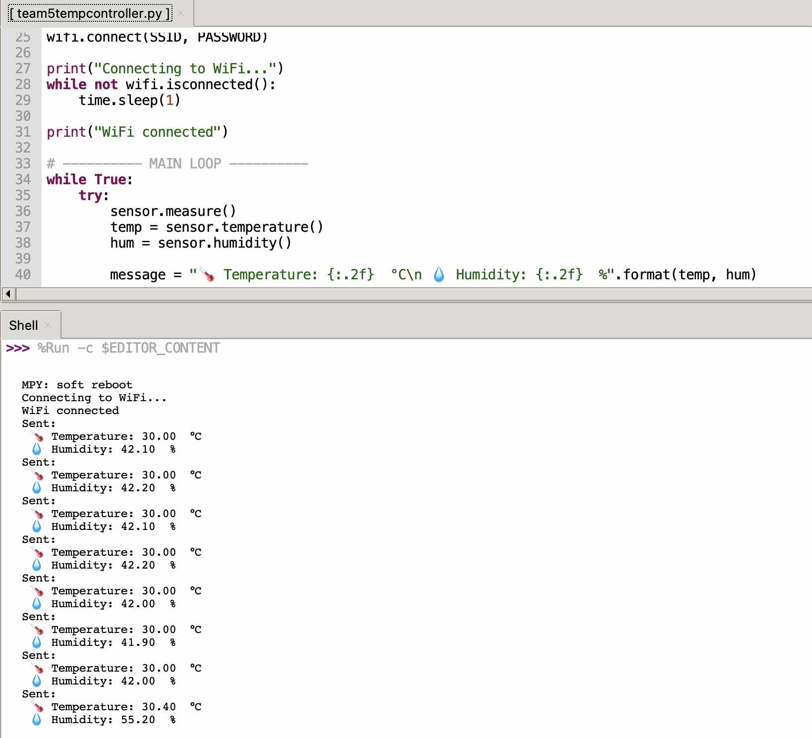
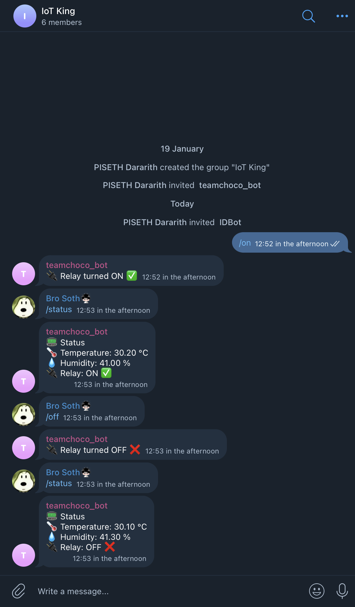

# ESP32 Telegram-Controlled Relay with DHT22

This project uses an ESP32 microcontroller to read temperature and humidity from a DHT11 sensor and control a relay module via Telegram commands.

---

## 🔌 Wiring Diagram / Hardware Connections

### Components Used
- ESP32 Dev Module (ESP32-WROOM-32)
- ESP32 Expansion Board
- DHT11 Temperature & Humidity Sensor
- 1-Channel 5V Relay Module
- Jumper wires

### Wiring Connections

#### DHT11 → ESP32
| DHT11 Pin | ESP32 Pin |
|----------|-----------|
| VCC (+) | VCC/3V3 |
| DATA (I/O) | GPIO 4 (D4) |
| GND (-) | GND |

#### Relay Module → ESP32
| Relay Pin | ESP32 Pin |
|----------|-----------|
| VCC | VCC/5V (VIN) |
| GND | GND |
| IN | GPIO 2 (D2)|


---

## ⚙️ Configuration Steps

### 1. Telegram Bot Setup
1. Create a Telegram bot using **@BotFather**
2. Copy the generated **Bot Token**
3. Add the bot to your Telegram group
4. Get the **Group Chat ID**

### 2. Code Configuration
Update the following values in the code:

```python
BOT_TOKEN = "YOUR_BOT_TOKEN"
CHAT_ID = "YOUR_CHAT_ID"
DHTPIN = 4
RELAY_PIN = 2
```

### 3. Wi-Fi Credentials

```python
SSID = "YOUR_WIFI_NAME"
PASSWORD = "YOUR_WIFI_PASSWORD"
```

---

## ▶️ Usage Instructions

1. Power the ESP32 via USB
2. ESP32 connects to Wi-Fi
3. ESP32 connects to Telegram bot
4. Use the following commands in Telegram:

| Command   | Description                                 |
| --------- | ------------------------------------------- |
| `/status` | Get temperature, humidity, and relay status |
| `/on`     | Turn relay ON                               |
| `/off`    | Turn relay OFF                              |

> If the relay is OFF, temperature and humidity are not displayed.

---

## 🔁 Program Flow / Block Diagram

### System Flowchart


---

## 📝 Task Requirements

### Task 1 – Sensor Read & Print

- Read DHT11 every 5 seconds and print the temperature and humidity with 2 decimals.
- **Evidence:**



---

### Task 2 – Telegram Send

- Implement `send_message()` and post a test message to your group.
- **Evidence:**


---

### Task 3 – Bot Command

- Implement `/status` to reply with current temperature, humidity, and relay state.
- Implement `/on` and `/off` to control the relay.
- **Evidence:**




---

### Task 4 – Bot Command

- No messages while temperature < 30 °C.
- If temperature ≥ 30 °C and relay is OFF, send an alert every loop (5 s) until `/on` is received.
- After `/on`, stop alerts. When temperature < 30 °C, turn relay OFF automatically and send a one-time “auto-OFF” notice.
- **Evidence:** [Task 4 Video](https://aupp-my.sharepoint.com/:v:/g/personal/2024321thy_aupp_edu_kh/IQAqkap3C7WEQ6NtTVoRbUaCAbjkEdITe1jTleTDORXA85I?nav=eyJyZWZlcnJhbEluZm8iOnsicmVmZXJyYWxBcHAiOiJPbmVEcml2ZUZvckJ1c2luZXNzIiwicmVmZXJyYWxBcHBQbGF0Zm9ybSI6IldlYiIsInJlZmVycmFsTW9kZSI6InZpZXciLCJyZWZlcnJhbFZpZXciOiJNeUZpbGVzTGlua0NvcHkifX0&e=rDtukK)

---

## 📌 Author

ESP32 IoT Project Team 5 – Telegram Bot Control

