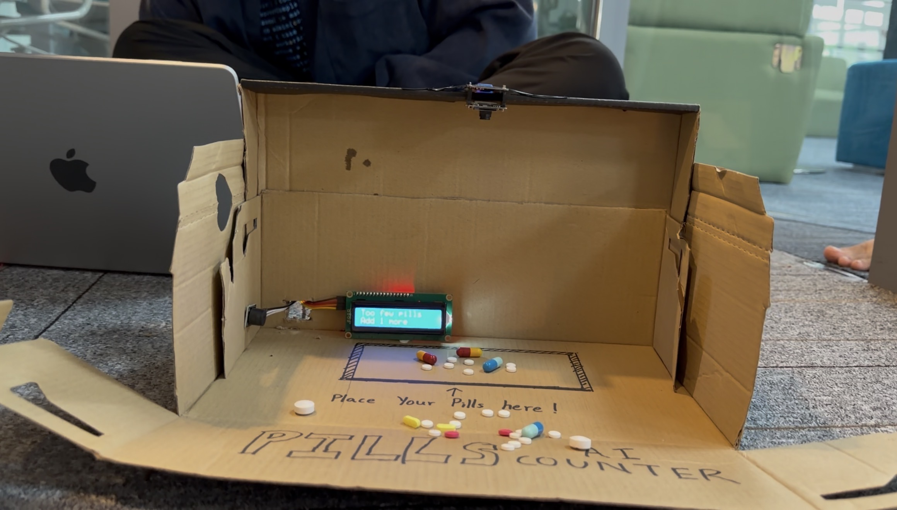
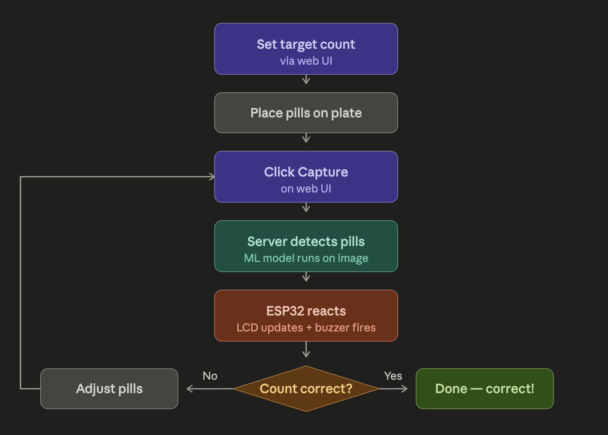
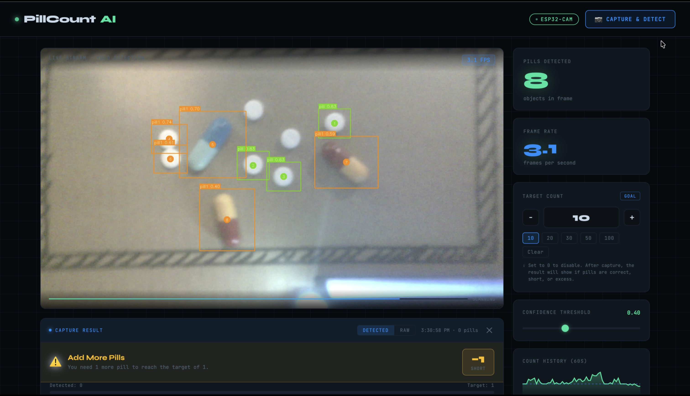

# 💊 IoT Smart Pill Counter System

> Automated pill counting using ESP32-CAM, machine learning, and real-time feedback via LCD and buzzer.



---

## 📖 Overview

Counting pills manually in hospitals and pharmacies is slow, repetitive, and easy to get wrong. A wrong pill count can directly harm patients, making accuracy critical. Staff are expected to count accurately even under heavy workload and time pressure.

The **IoT Smart Pill Counter** solves this by automatically detecting and counting pills using a camera and machine learning, then telling the user whether the count is correct, too low, or too high — all through a simple web interface with real-time LCD and buzzer feedback.

---

## 🧰 Components Required

| Component | Purpose |
|---|---|
| **ESP32-CAM (AI Thinker)** | Captures images of the pills and streams footage over WiFi to the server |
| **ESP32** | Polls the server for results and controls the LCD and buzzer |
| **Buzzer** | Sounds different patterns based on whether the count is correct, too low, or too high |
| **LCD Screen (16x2 I2C)** | Displays the current status and instructions to the user in plain text |
| **Pills** | Placed flat on a counting plate within clear view of the ESP32-CAM |


<!-- 🖼️ IMAGE: A flat lay photo of all the hardware components laid out neatly — ESP32-CAM, ESP32, buzzer, LCD screen, and a small pile of pills on a white plate -->

---

## 🏗️ System Architecture

The user starts by opening the web UI on any phone or computer connected to the same WiFi network. From there, they type in the number of pills they need — this is sent to the Flask server and stored as the target count.

Once the target is set, the user pours the pills onto the counting plate and clicks the **Capture** button on the web UI. This triggers the server to send a request to the ESP32-CAM, which takes a still photo of the plate and sends it back. The server then runs the pre-trained ML model on that image to detect and count every pill visible on the plate.

After counting, the server compares the detected number against the target and generates a result. The ESP32 polls the server every second in the background and the moment it sees a new result, it reacts immediately.

### LCD & Buzzer Behaviour

| Result | LCD Line 1 | LCD Line 2 | Buzzer |
|---|---|---|---|
| ✅ Correct | `Correct! :)` | `Count is perfect` | 1 long beep |
| ➕ Too few | `Too few pills!` | `Add X more` | 2 short pulses |
| ➖ Too many | `Too many pills!` | `Remove X` | 3 rapid pulses |

Once the user adjusts the pills, they press **Capture** again. The process repeats until the correct count is reached.


<!-- 🖼️ IMAGE: The system flowchart diagram showing the full flow from setting target → placing pills → clicking capture → ML detection → ESP32 feedback → adjust and retry loop -->

---

## 🌐 Web UI

The web interface is served directly by the Flask server and can be opened on any device on the same WiFi network. It shows the live camera feed, lets the user set the target pill count, and has a Capture button to trigger detection.


<!-- 🖼️ IMAGE: A screenshot of the web UI in a browser showing the live video feed with pill detection boxes drawn, the target count input field, and the Capture button -->

---

## 🚀 How to Run

### 1. ESP32-CAM — run first (Arduino IDE)

- Open Arduino IDE and select **AI Thinker ESP32-CAM** as the board
- Flash the CameraWebServer example or your custom firmware
- Power on the ESP32-CAM and connect it to your WiFi network
- Note down the IP address shown in the Serial Monitor — you will need it for the server config


<!-- 🖼️ IMAGE: A photo of the ESP32-CAM connected to a USB-to-serial programmer or powered via a breadboard, with the camera pointing downward at the counting plate -->

### 2. Flask Server + Web UI — run second

Update the ESP32-CAM IP address in `pill_server.py`:

```python
ESP32_URL = "http://YOUR_ESP32_CAM_IP"
```

Then run the server:

```bash
python3 pill_server.py --model best_model.onnx
```

Open your browser and go to:

```
http://localhost:5000
```

### 3. ESP32 — run last (Thonny)

Update the WiFi credentials and server IP in `esp32.py`:

```python
WIFI_SSID  = "your_wifi_name"
WIFI_PASS  = "your_wifi_password"
SERVER_URL = "http://YOUR_SERVER_IP:5000/capture_result"
```

- Open Thonny and connect to the ESP32
- Run `esp32.py`
- The LCD will show `WiFi Connected!` followed by `PillCount AI — Ready!`
- The ESP32 will now poll the server every second waiting for a capture event


<!-- 🖼️ IMAGE: A screenshot of Thonny IDE with esp32.py open and the shell showing "WiFi Connected!" and "PillCount AI Ready!" messages -->

---

## 📁 File Structure

```
pill-counter/
│
├── pill_server.py       # Flask server — handles ML inference and API routes
├── pill_ui.html         # Web UI — served at http://localhost:5000
├── esp32.py             # MicroPython firmware for ESP32 (LCD + buzzer)
├── best_model.onnx      # Pre-trained pill detection model (from GitHub)
└── README.md
```

---

## ⚙️ Design Decisions

- **Pre-trained model from GitHub** — used instead of training from scratch since training requires a large labeled dataset and significant time that the project timeline did not allow for
- **Feedback only triggers on capture** — rather than reacting to every live frame, which would cause the buzzer to fire constantly and the LCD to flicker while the user is still arranging pills
- **ESP32 polls the server every second** — MicroPython does not support push notifications, so a simple capture ID counter is used to detect when a new result is available
- **CAM and ESP32 are separate devices** — the ESP32-CAM handles only image capture and streaming, while the ESP32 handles only the LCD and buzzer, keeping each part simple and easy to troubleshoot
- **Server is the single source of truth** — the pill count, target, and latest result all live in one place so the web UI and the ESP32 always see the same data without needing to communicate directly with each other

---

## 👥 Team

| Name |
|---|
| KOU, Sok Panha |
| NGUON, Yeanchea |
| PISETH, Dararith |
| THY, Panhasoth |

**Lecturer:** SENG Theara  
**Institution:** American University of Phnom Penh  
**Date:** April 2026