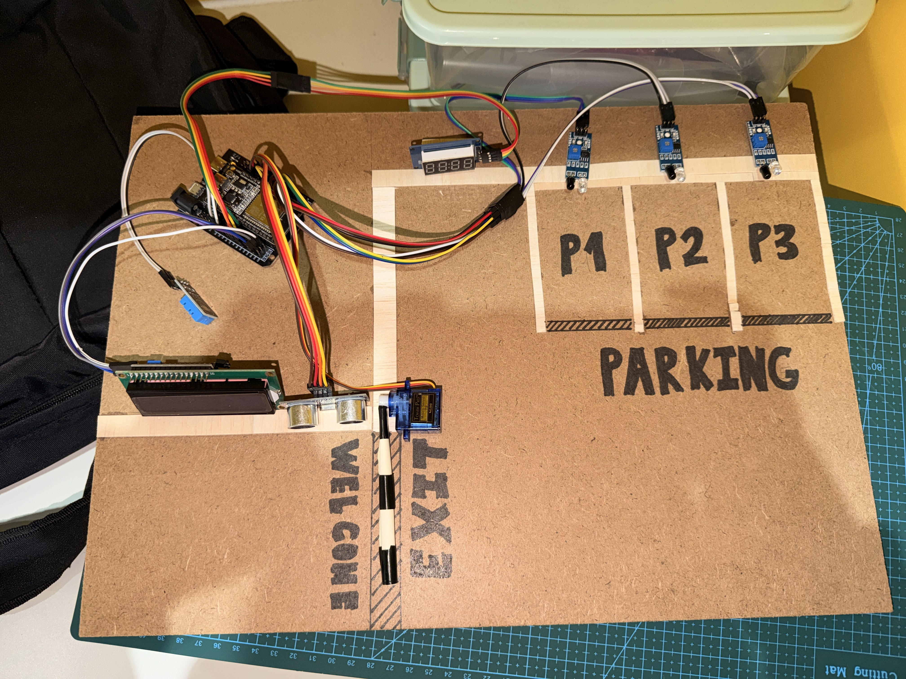
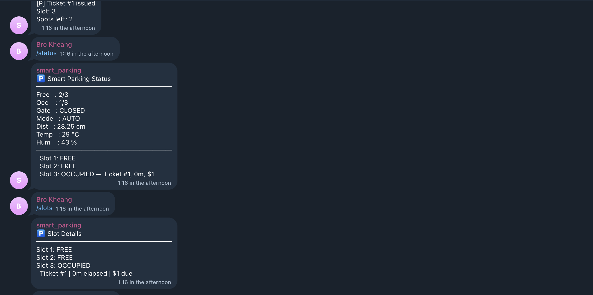
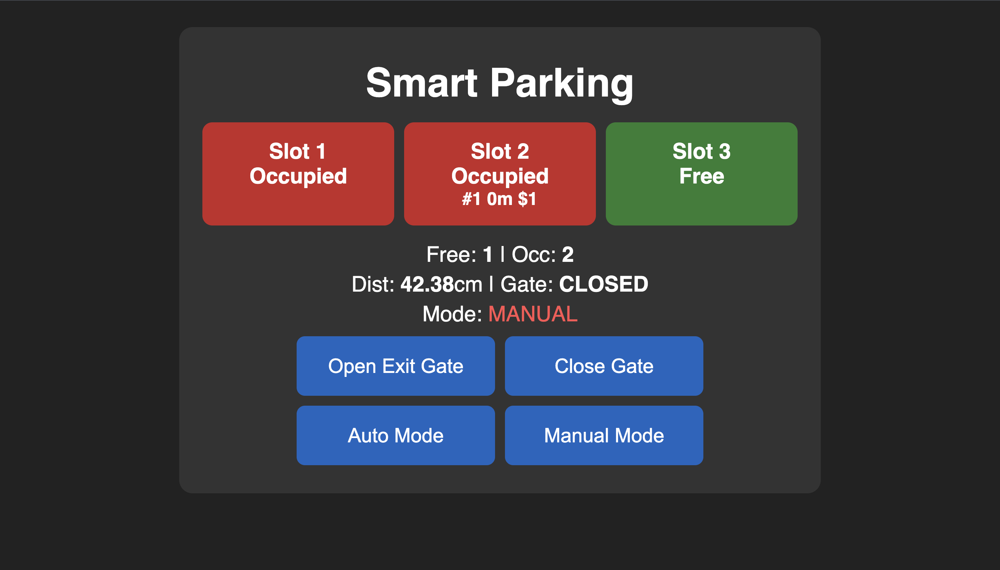
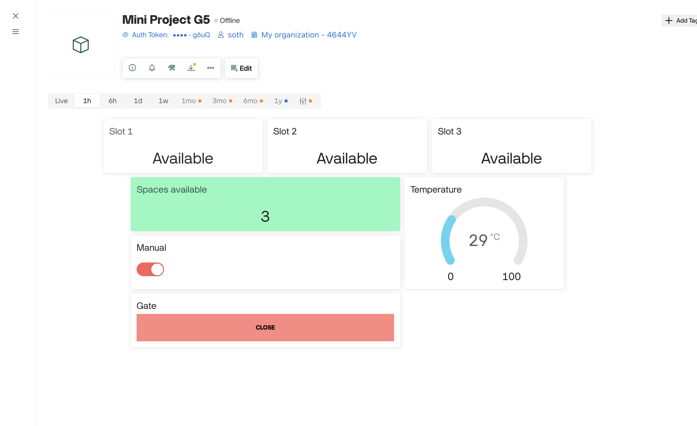

# 🚗 Smart IoT Parking Management System

> MicroPython-based IoT project using ESP32 with multi-platform integration (Telegram, Web, Blynk)

---

## 📌 Project Overview
This project implements a **Smart IoT Parking Management System** using ESP32 and MicroPython.  
The system integrates sensors, actuators, and multiple IoT platforms to provide **real-time parking monitoring and control**.

---

## 🎯 Project Objectives
- Design a complete embedded IoT system  
- Integrate hardware with cloud platforms  
- Implement real-time monitoring and automation  
- Develop system-level logic and control  
- Present and document the system professionally  

---

## 🧰 Hardware Components

| Component | Description |
|----------|------------|
| ESP32 | Main microcontroller |
| Ultrasonic Sensor | Detect incoming vehicles |
| IR Sensors (x3+) | Detect parking slot occupancy |
| Servo Motor | Gate barrier control |
| DHT11 | Temperature & humidity sensor |
| TM1637 Display | Display available slots |
| LCD I2C | Show system status |

### 📷 Hardware Setup Evidence
<!-- Insert hardware images here -->

---

## 🌐 IoT Platforms Used

- Telegram Bot (commands & notifications)
- Web Dashboard (monitoring & control)
- Blynk App (remote control & display)

### 📷 Platform Screenshots
<!-- Insert platform screenshots here -->

---

## ⚙️ System Architecture

### 🔹 Block Diagram
<!-- Insert system architecture diagram -->

### 🔹 Process Flow
<!-- Insert flowchart -->

---

## 🧠 System Logic (Simplified)
1. Detect vehicle using Ultrasonic Sensor  
2. Check available parking slots  
3. Open gate if slots available  
4. Update slot count using IR sensors  
5. Display data on TM1637 & LCD  
6. Send updates via Telegram, Web, and Blynk  

---

## 💻 Software Architecture

### 📁 Code Structure

| File | Description |
|------|------------|
| `web.py` | Web dashboard server |
| `blynk.py` | Blynk integration |
| `telegram.py` | Telegram command handler (run in Thonny) |
| `telegram_bot.py` | Telegram bot backend |

<!-- ### 📷 Code Screenshots -->
<!-- Insert code screenshots -->
<!--  -->

---

## 🔗 IoT Integration

### 🤖 Telegram Bot Commands
- `/status`
- `/slots`
- `/temp`
- `/manual_on`
- `/manual_off`
- `/open`
- `/close`

### 📷 Telegram Interaction
<!-- Insert telegram interaction screenshots -->

---

### 🌍 Web Dashboard Features
- Display available slots  
- Display temperature  
- Show gate status  
- Show relay status  
- Manual open/close gate button  

### 📷 Web Dashboard UI
<!-- Insert dashboard images -->

---

### 📱 Blynk Features
- Servo control button  
- Temperature display  
- Slot counter widget  

### 📷 Blynk App
<!-- Insert Blynk screenshots -->

---

## 🔄 Working Process Explanation

1. Car arrives → detected by Ultrasonic sensor  
2. System checks slot availability  
3. Gate opens if space is available  
4. IR sensors update slot status  
5. Data updates across:
   - TM1637 display  
   - LCD screen  
   - Web dashboard  
   - Telegram bot  
   - Blynk app  
6. Lights controlled (auto/manual)  

---

## 💡 Smart Features
- Real-time slot monitoring  
- Multi-platform control (Telegram, Web, Blynk)  
- Automatic gate system  
- Remote lighting control  
- Live temperature monitoring  

---

<!-- ## ⚠️ Challenges Faced
- Synchronizing multiple IoT platforms  
- Handling real-time updates  
- Debugging MicroPython limitations  
- Network stability issues  
- Sensor accuracy calibration  

---

## 🚀 Future Improvements
- Add mobile app (custom UI)  
- Use camera-based vehicle detection  
- Add payment system integration  
- Improve UI/UX design  
- Cloud database integration  

--- -->

## 🎥 Video Presentation

👉 Watch the full project demo here:  
[▶️ Watch on YouTube](https://youtu.be/NjHtIlr9m5Y)

---

## 📌 Important Notes
- All components are fully integrated  
- System runs live during demonstration  
- Each team member contributes to development  