# 🚗 Smart IoT Parking Management System

> MicroPython-based IoT project using ESP32 with multi-platform integration (Telegram, Web Dashboard, and Blynk)

---

## 📌 Project Overview

This project implements a **Smart IoT Parking Management System** using an ESP32 running MicroPython. The system integrates multiple sensors, actuators, and three IoT platforms to deliver **real-time parking monitoring, automated gate control, and billing** — all accessible remotely from Telegram, a web browser, or the Blynk mobile app.

The system runs a non-blocking main loop (10 ms cycle) on the ESP32, processing ultrasonic entry detection, IR-based slot occupancy, DHT11 environmental data, and simultaneous HTTP + cloud requests without stalling.

---

## 🎯 Project Objectives

- Design a complete embedded IoT system from hardware to cloud
- Integrate physical sensors and actuators with multiple cloud platforms
- Implement real-time monitoring, automated decision logic, and billing
- Apply system-level engineering thinking across hardware and software layers
- Document the system architecture professionally
- Present the technical workflow clearly through code, diagrams, and video

---

## 🧰 Hardware Components

| Component | Pin(s) | Role |
|-----------|--------|------|
| **ESP32** | — | Main microcontroller running MicroPython |
| **Ultrasonic HC-SR04** | TRIG: 26 · ECHO: 25 | Detect incoming vehicles at the entrance |
| **IR Sensor × 3** | GPIO 32, 35, 34 | Detect occupancy of each parking slot |
| **Servo Motor** | GPIO 13 (PWM 50 Hz) | Gate barrier control (0° closed · 90° open) |
| **DHT11** | GPIO 4 | Temperature & humidity monitoring |
| **Exit Button** | GPIO 27 (PULL_UP) | Physical manual exit trigger |
| **TM1637 Display** | CLK: 18 · DIO: 19 | Show number of available slots |
| **LCD I2C 16×2** | SDA: 21 · SCL: 22 | Display live system status |

### 📷 Hardware Setup Evidence
<!-- Insert hardware images here -->

---

## 🌐 IoT Platforms Used

- **Telegram Bot** — push notifications and remote command interface
- **Web Dashboard** — browser-based live monitoring and manual control
- **Blynk App** — mobile remote control with virtual pin widgets

---

## ⚙️ System Architecture

### 🔹 Hardware Layer

The system is built around an **ESP32** microcontroller running MicroPython. All sensors and actuators connect directly via GPIO:

- **Ultrasonic HC-SR04** (TRIG: GPIO 26, ECHO: GPIO 25) — detects incoming vehicles at the entrance by measuring distance. Sampled every 60 ms using two readings with the minimum taken for stability.
- **IR Sensors × 3** (GPIO 32, 35, 34) — one per parking slot. A LOW signal (0) means the slot is occupied; HIGH (1) means free.
- **DHT11** (GPIO 4) — reads temperature and humidity every 2 s.
- **Servo Motor** (GPIO 13, PWM 50 Hz) — controls the gate barrier. 0° = closed, 90° = open.
- **Exit Button** (GPIO 27, PULL_UP) — physical manual gate trigger, debounced at 250 ms.
- **TM1637 Display** (CLK: GPIO 18, DIO: GPIO 19) — shows the number of free slots, updated every 300 ms.
- **LCD I2C 16×2** (SDA: GPIO 21, SCL: GPIO 22) — shows live free/occupied count, temperature, humidity, and distance, updated every 500 ms.

---

### 🔹 Software Layer

The firmware runs a single **non-blocking main loop** with a 10 ms sleep cycle. All tasks — sensor reads, gate logic, web serving, and cloud updates — are time-sliced within this loop using elapsed-time checks (`ticks_diff`), so no task ever blocks another.

There are three ESP32 firmware files depending on which platform is active:

- **`web.py`** — full system with web server (HTTP port 80), JSON `/api/status` endpoint, HTML dashboard, core parking logic, billing engine, and Telegram push notifications.
- **`blynk.py`** — standalone Blynk variant with all core parking logic plus V0–V6 virtual pin sync; no web server.
- **`telegram.py`** — Thonny-compatible development variant of `web.py`.

The **`telegram_bot.py`** script runs separately on a laptop. It long-polls the Telegram `getUpdates` API, dispatches commands, and communicates with the ESP32 via HTTP requests to `/api/status` and the gate control endpoints.

---

### 🔹 Network Layer

All cloud communication goes through the ESP32's WiFi STA interface:

- **Telegram push** — the ESP32 sends event notifications (ticket issued, bill generated, parking full) directly via `urequests` GET with URL-encoded message strings.
- **Web server** — a non-blocking TCP socket server handles HTTP requests using `select()` with a 0-second timeout so it never stalls the main loop.
- **Blynk cloud** — virtual pins are pushed (`blynk_set`) and polled (`blynk_get`) on independent timers ranging from 500 ms (servo/mode) to 2000 ms (temperature).

---

### 🔹 Multi-Platform Control Matrix

| Control Source | Open Gate | Close Gate | AUTO Mode | MANUAL Mode | View Status |
|---|---|---|---|---|---|
| **Ultrasonic** (AUTO) | ✅ on detect | ⏱ auto 2.5 s | — | — | — |
| **Exit Button** | ✅ force open | — | — | — | — |
| **Web Dashboard** | ✅ `/open` | ✅ `/close` | ✅ `/auto` | ✅ `/manual` | ✅ HTML page |
| **Telegram Bot** | ✅ `/open` | ✅ `/close` | ✅ `/manual_off` | ✅ `/manual_on` | ✅ `/status` `/slots` `/temp` |
| **Blynk App** | ✅ V0 slider | ✅ V0 = 0 | ✅ V5 = 0 | ✅ V5 = 1 | ✅ V1–V6 widgets |

---

### 🔹 Complete System Flowchart

```mermaid
flowchart TD
    A([Start: ESP32 Boot]) --> B[Connect to WiFi]
    B --> B1{WiFi Connected?}
    B1 -->|Yes| B2[Start Web Server on Port 80]
    B1 -->|No| B3[Continue in offline mode]
    B2 --> C
    B3 --> C

    C[Initialize Hardware\nServo · LCD · TM1637 · DHT11] --> D[Read boot IR states]
    D --> D1{Any slot occupied\nat boot?}
    D1 -->|Yes| D2[Assign tickets to\npre-parked cars]
    D1 -->|No| E
    D2 --> D3[Send Telegram boot notification]
    D3 --> E

    E([Enter Main Loop]) --> F

    F[Read IR Sensors\nSlot 1 · Slot 2 · Slot 3] --> F1[Compute free / occupied count]
    F1 --> G[Poll exit button\ndebounce 250ms]
    G --> G1{Button pressed?}
    G1 -->|Yes| G2[Force open gate\nignore cooldown]
    G1 -->|No| H
    G2 --> H

    H[Process pending entry\ncheck IR transition] --> H1{Slot changed\nfree → occupied?}
    H1 -->|Yes| H2[Issue Ticket #N\nrecord start_ms\nSend Telegram]
    H1 -->|No| H3{Timeout\n12s exceeded?}
    H3 -->|Yes| H4[Clear pending entry\nno ticket issued]
    H3 -->|No| I
    H2 --> I
    H4 --> I

    I[Check slot exits\ncompare IR vs previous] --> I1{Slot changed\noccupied → free?}
    I1 -->|Yes| I2[Retrieve ticket for Slot N]
    I2 --> I3[Calculate duration\nround up to minutes · min 1 min]
    I3 --> I4[Calculate fee\nminutes × $1]
    I4 --> I5[Send Telegram billing receipt\nSlot · Ticket · Duration · Amount]
    I5 --> I6[Clear slot_tickets N = None]
    I1 -->|No| J
    I6 --> J

    J{Ultrasonic timer\nevery 60ms?} -->|Yes| J1[Measure distance\n2 samples · take minimum]
    J -->|No| K
    J1 --> J2{Distance\n≤ 10cm?}
    J2 -->|Yes · new detection| J3{Slots\navailable?}
    J2 -->|No| J7[Clear entry presence flag]
    J3 -->|No| J4[Send Telegram\nParking FULL\ncooldown 10s]
    J3 -->|Yes| J5{AUTO\nmode?}
    J5 -->|Yes| J6[Open gate · Servo → 90°\nSnapshot IR states\nCreate pending entry\nSend Telegram]
    J5 -->|No · MANUAL| J8[Send Telegram\nCar at entrance\nManual mode]
    J4 --> K
    J6 --> K
    J7 --> K
    J8 --> K

    K[Gate auto-close timer] --> K1{Gate open AND\nAUTO mode AND\n2.5s elapsed?}
    K1 -->|Yes| K2[Close gate\nServo → 0°]
    K1 -->|No| L
    K2 --> L

    L{DHT11 timer\nevery 2s?} -->|Yes| L1[Read temperature\nand humidity]
    L -->|No| M
    L1 --> M

    M{TM1637 timer\nevery 300ms?} -->|Yes| M1[Update TM1637\ndisplay free count]
    M -->|No| N
    M1 --> N

    N{LCD timer\nevery 500ms?} -->|Yes| N1[Refresh LCD\nFree · Occ · Temp · Hum · Dist]
    N -->|No| O
    N1 --> O

    O{Incoming HTTP\nrequest?} -->|Yes| O1{Parse path}
    O -->|No| P
    O1 -->|/open| O2[Open gate · web source]
    O1 -->|/close| O3[Close gate]
    O1 -->|/auto| O4[Set AUTO mode]
    O1 -->|/manual| O5[Set MANUAL mode]
    O1 -->|/api/status| O6[Return JSON status\nfor Telegram bot]
    O1 -->|/| O7[Render HTML dashboard\nSlot cards · Controls]
    O2 --> P
    O3 --> P
    O4 --> P
    O5 --> P
    O6 --> P
    O7 --> P

    P{Blynk timers\nblynk.py only} -->|V5 · 500ms| P1[Poll V5\nAUTO / MANUAL toggle]
    P -->|V0 · 500ms\nMANUAL only| P2[Poll V0\nServo angle 0–90°]
    P -->|V1–V3 · 1000ms| P3[Push slot status\nAvailable / Occupied]
    P -->|V4 · 1000ms| P4[Push free\nslot count]
    P -->|V6 · 2000ms| P5[Push temperature\nto Blynk]
    P1 --> Q
    P2 --> Q
    P3 --> Q
    P4 --> Q
    P5 --> Q
    P -->|No Blynk| Q

    Q[Sleep 10ms] --> F
```

---

## 🧠 System Logic (Detailed)

### Entry Detection
1. Ultrasonic sensor samples distance every 60 ms (two readings, takes minimum for stability)
2. If distance ≤ 10 cm and no previous detection (`entry_presence` flag):
   - **Slots full** → send Telegram FULL alert (rate-limited to once per 10 s)
   - **AUTO mode + slots free** → open gate, snapshot IR states, create `pending_entry` object
   - **MANUAL mode** → send Telegram notification, gate stays closed
3. Entry is confirmed when any IR slot transitions from free → occupied within 12 s timeout
4. On confirmation: issue a timestamped ticket (`Ticket #N`, `start_ms` recorded)

### Exit & Billing
- Every loop iteration compares current IR readings against previous readings
- If any slot transitions from occupied → free: the ticket is retrieved, duration calculated (rounded up to minutes, minimum 1 minute), fee computed at $1/min, and a billing summary sent via Telegram
- Physical exit button and web `/open` command force-open the gate ignoring the 6 s cooldown

### Gate Control
- `trigger_gate_open()` enforces a 6 s cooldown between consecutive auto-opens (entry gate)
- Exit-triggered opens (`ignore_cooldown=True`) bypass this guard
- AUTO mode: gate auto-closes after 2.5 s via a `gate_open_until` timer
- MANUAL mode: gate stays at its current position until explicitly commanded

---

## 💻 Software Architecture

### 📁 Code Structure

| File | Runs On | Description |
|------|---------|-------------|
| `web.py` | ESP32 | Full system: web server (HTTP :80), JSON `/api/status` endpoint, HTML dashboard, all core parking logic, billing engine, Telegram push |
| `blynk.py` | ESP32 | Blynk-integration variant: all core parking logic + Blynk virtual pin sync (V0–V6); no web server |
| `telegram.py` | ESP32 | Thonny-compatible variant of `web.py` for development/testing |
| `telegram_bot.py` | Laptop | Python 3 bot backend; long-polls Telegram `getUpdates`, dispatches commands to ESP32 via HTTP `/api/status` |

### Key Design Decisions

**Non-blocking web server** — uses `socket.setblocking(False)` and `select.select()` with a 0-second timeout so HTTP requests are handled within the main loop without pausing sensor reads.

**Separate Blynk file** — Blynk requires frequent polling of virtual pins (every 500 ms), which conflicts with the web server's socket handling. `blynk.py` is a standalone variant that runs either integration cleanly.

**URL-encoded Telegram push** — MicroPython's `urequests` is used with manually URL-encoded query strings to avoid JSON body overhead on memory-constrained hardware.

**Ticket state machine** — `slot_tickets[]` is an array of three optional ticket objects. Each ticket stores its ID and `start_ms` timestamp. Fee calculation uses `ticks_diff()` for accurate millisecond-resolution duration even after `ticks_ms()` overflow.

---

## 🔗 IoT Integration

### 🤖 Telegram Bot Commands

| Command | Description |
|---------|-------------|
| `/status` | Full parking overview: free/occupied count, gate state, mode, distance, temp, humidity, per-slot detail |
| `/slots` | Per-slot detail: ticket number, elapsed time, fee due |
| `/temp` | Temperature and humidity only |
| `/open` | Open gate (MANUAL mode only) |
| `/close` | Close gate (MANUAL mode only) |
| `/manual_on` | Switch to MANUAL mode — gate will not open automatically |
| `/manual_off` | Switch back to AUTO mode |

The bot (`telegram_bot.py`) runs on a laptop on the same WiFi network. It polls `/api/status` on the ESP32 to fetch live JSON data, then formats and forwards it as Telegram messages. Gate commands are forwarded as HTTP requests to `/open`, `/close`, `/auto`, or `/manual`.

### 📷 Telegram Interaction
<!-- Insert telegram interaction screenshots here -->

---

### 🌍 Web Dashboard Features

- Color-coded slot cards (🟢 Free / 🔴 Occupied) with ticket ID, elapsed time, and fee
- Live free/occupied count, gate state, distance, and operating mode
- Auto-refresh every 3 s in AUTO mode (disabled in MANUAL to prevent accidental state changes)
- Manual control buttons: Open Gate, Close Gate, Auto Mode, Manual Mode
- Responsive mobile layout (360 px max-width)

The dashboard is served directly from the ESP32 with CSS inlined as raw bytes to avoid MicroPython string-format conflicts with curly braces.

### 📷 Web Dashboard UI
<!-- Insert dashboard images here -->

---

### 📱 Blynk App Features

| Virtual Pin | Widget | Direction | Description |
|-------------|--------|-----------|-------------|
| V0 | Slider (0–90) | Read | Servo angle control (MANUAL mode only) |
| V1 | Label | Write | Slot 1 status: `Available` / `Occupied` |
| V2 | Label | Write | Slot 2 status: `Available` / `Occupied` |
| V3 | Label | Write | Slot 3 status: `Available` / `Occupied` |
| V4 | Value Display | Write | Number of free slots (matches TM1637) |
| V5 | Switch | Read | Mode toggle: 0 = AUTO · 1 = MANUAL |
| V6 | Value Display | Write | Temperature (°C from DHT11) |

When the mode switches (V5), the system automatically resets V0 to 0 and closes the gate to ensure the physical servo matches the Blynk slider position.

### 📷 Blynk App
<!-- Insert Blynk screenshots here -->

---

## 💡 Smart Features

- **Automated billing** — per-minute ticket tracking with timestamped start; bill generated automatically on departure
- **Dual gate modes** — AUTO (ultrasonic-triggered) and MANUAL (command-driven via Telegram, Web, or Blynk)
- **Multi-platform control** — every gate and mode action is reachable from Telegram, Web, and Blynk simultaneously
- **Cooldown guard** — 6 s minimum between consecutive auto-opens prevents double-triggering
- **Boot recovery** — pre-parked cars at startup are detected and assigned tickets immediately
- **Non-blocking architecture** — sensor reads, web serving, and cloud updates are all time-sliced within a single 10 ms loop with no thread dependencies
- **Live environmental monitoring** — temperature and humidity visible on LCD, Web, and Blynk in real time

---

## 🎥 Video Presentation

👉 Watch the full project demo here:  
[▶️ Watch on YouTube](https://youtu.be/NjHtIlr9m5Y)

---

## 📌 Important Notes

- All hardware components are fully integrated and required for live operation
- The system runs live and uninterrupted during demonstration
- Each team member contributes actively to development and the live demo
- `telegram_bot.py` must be running on a laptop connected to the same WiFi network as the ESP32 for Telegram commands to reach the hardware